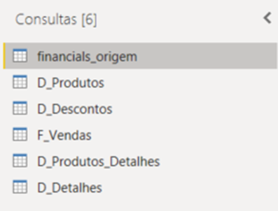
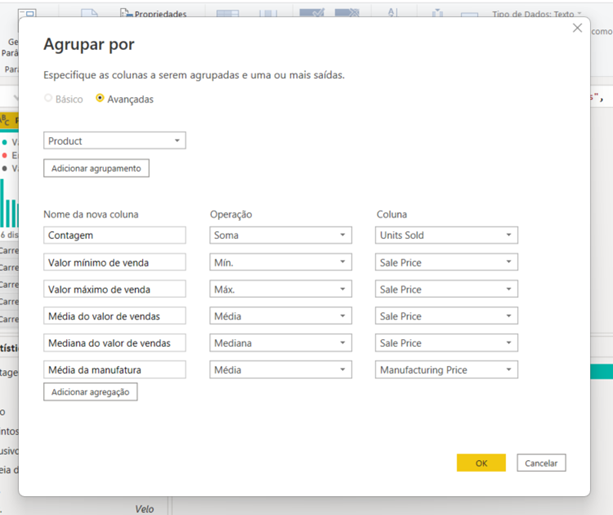
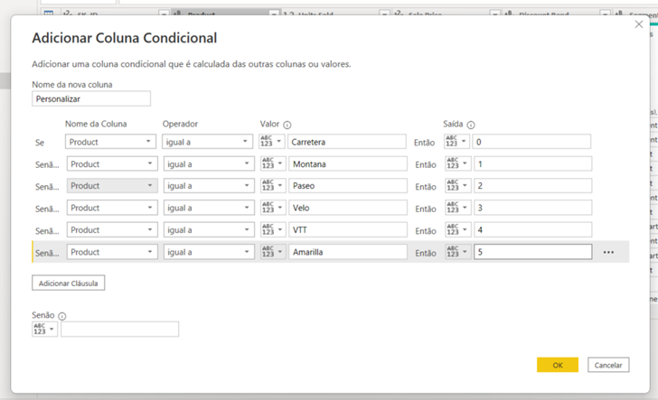
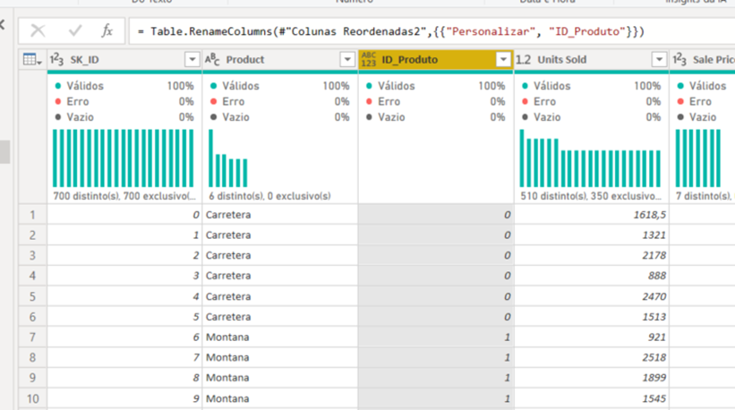
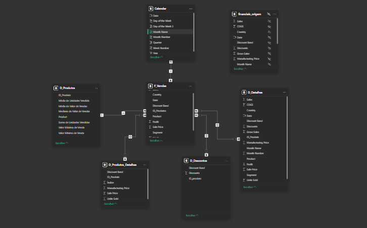

# dio-suzano
## Suzano - Análise de Dados com Power BI

#### Objetivo: 

Utilizaremos a tabela única de Financial Sample para criar as tabelas dimensão e fato do nosso modelo baseado em star schema.

O processo consiste na criação das tabelas com base na tabela original. A partir da cópia serão selecionadas as colunas que irão compor a visão da nova tabela. Sendo assim, a partir da tabela principal serão criadas as tabelas:

<b>Financials_origem (modo oculto – backup)</b>

D_Produtos (ID_produto, Produto, Média de Unidades Vendidas, Médias do valor de vendas, Mediana do valor de vendas, Valor máximo de Venda, Valor mínimo de Venda)

D_Produtos_Detalhes(ID_produtos, Discount Band, Sale Price, Units Sold, Manufactoring Price)

D_Descontos (ID_produto, Discount, Discount Band)

D_Detalhes (*)

D_Calendário – Criada por DAX com calendar()

F_Vendas (SK_ID , ID_Produto, Produto, Units Sold, Sales Price, Discount Band, Segment, Country, Salers, Profit, Date (campos))

`*Verifique as informações que não foram contempladas nas demais tabelas dimensão que fornecem maiores detalhes sobre vendas.`

*Exemplo de tabela criada por agrupamento das informações*

*Exemplo de coluna sendo construída a partir de condicional – Índice de Produtos*

*Reorganize as colunas*

`Não se esqueça de salvar seu projeto para submeter ao Github. O link do seu repositório é utilizado na submissão do seu desafio de projeto.`

**Você pode utilizar os seguintes pontos como base:**

· Salve o projeto .pbix

· Salve uma imagem do seu esquema em estrela

· Escreva no readme o processo de construção do seu diagrama
- Foi utilizado o modelo proposto em aula, com a inclusão da coluna ID_Produto na tabela D_Detalhes e a criação da tabela Calendar;

· Fale sobre as etapas as funcionalidades e funções DAX utilizadas neste projeto

- Calendar = CALENDARAUTO(12);
- Year = YEAR('Calendar'[Date]);
- Month Number = MONTH('Calendar'[Date]);
- Day of the Week = WEEKDAY('Calendar'[Date]);
- Day of the Week 2 = FORMAT('Calendar'[Date], "DDDD");
- Quarter = QUARTER('Calendar'[Date]);
- Formatação da coluna Date da Tabela Calendar e F_Vendas para Short Date;

Utilize o repositório do Github como uma descrição do seu projeto para auxiliar outras pessoas e ser visto pelos recrutadores. 