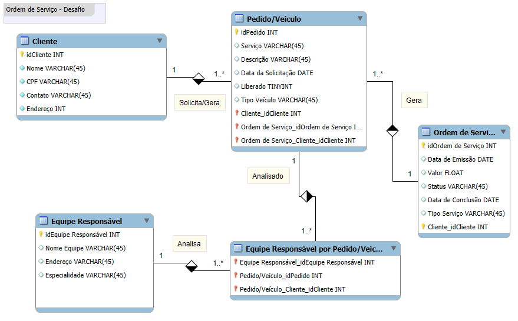

# dio-suzano
## Suzano - Análise de Dados com Power BI

### Objetivo:

Cria o esquema conceitual para o contexto de oficina com base na narrativa fornecida. 

#### Narrativa:

    Sistema de controle e gerenciamento de execução de ordens de serviço em uma oficina mecânica.
    Clientes levam veículos à oficina mecânica para serem consertados ou para passarem por revisões periódicas.
    Cada veículo é designado a uma equipe de mecânicos que identifica os serviços a serem executados e preenche uma OS com data de entrega.
    A partir da OS, calcula-se o valor de cada serviço, consultando-se uma tabela de referência de mão-de-obra.
    O valor de cada peça também irá compor a OSO cliente autoriza a execução dos serviços.
    A mesma equipe avalia e executa os serviços
    Os mecânicos possuem código, nome, endereço e especialidade.
    Cada OS possui: n°, data de emissão, um valor, status e uma data para conclusão dos trabalhos.

## Diagrama

#### Resumo:
    As informções dos clientes são obrigatórias na hora do cadastro (Nome, CPF, Endereço, Contato);
    Um cliente solicita/gera um pedido por veículo, mas também um cliente pode ter mais de um veículo.
    ______________________________________________
    
    Cada veículo gera um pedido e nele constam o Tipo de Serviço, Descrição, Data de Solicitação, Se foi Liberado (S/N), Tipo de Veículo;
    O pedido é analisado para ver a qual equipe será enviada.
    ______________________________________________

    A equipe responsável receberá o veículo e eles podem receber mais de um veículo/pedido;
    Cada equipe tem cadastrado seus nomes, Endereços e Especialidades.
    ______________________________________________

    A Ordem de Serviço é aberta por cada pedido;
    Nela constam a Data de Emissão, Valor (Que será confirmado com o cliente), Status, Data de Conclusão e Tipo de Serviço.

